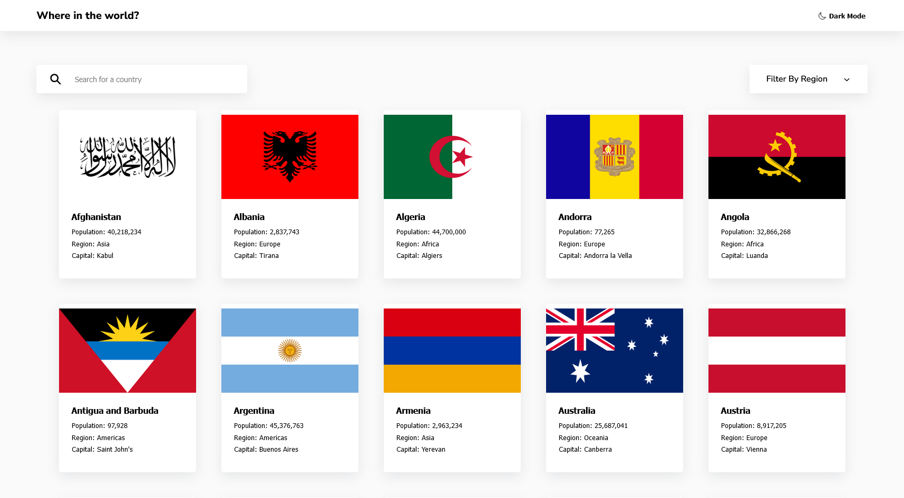

# Frontend Mentor - REST Countries API with color theme switcher solution

This is a solution to the [REST Countries API with color theme switcher challenge on Frontend Mentor](https://www.frontendmentor.io/challenges/rest-countries-api-with-color-theme-switcher-5cacc469fec04111f7b848ca). Frontend Mentor challenges help you improve your coding skills by building realistic projects. 

## Table of contents

- [Overview](#overview)
  - [The challenge](#the-challenge)
  - [Screenshot](#screenshot)
  - [Links](#links)
- [Useful resources](#useful-resources)
- [Author](#author)
- [Acknowledgments](#acknowledgments)

## Overview

### The challenge

Users should be able to:

- ✔️ See all countries from the API on the homepage
- ✔️ Search for a country using an `input` field
- ✔️ Filter countries by region
- ✔️ Click on a country to see more detailed information on a separate page
- ✔️ Click through to the border countries on the detail page
- ✔️ Toggle the color scheme between light and dark mode *(optional)*

### Screenshot

### Links

- Live Site URL: [Github](https://justinjovert.github.io/REST-Countries-API)

### Useful resources

- [Asaeneh's 30 Day of JavaScript](https://github.com/Asabeneh/30-Days-Of-JavaScript)
- [CSS Scan](https://getcssscan.com/css-box-shadow-examples)
- [Ionicons](https://ionic.io/ionicons)

## Author

- [Github](https://github.com/Justinjovert/)
- Frontend Mentor - [Justinjovert](https://www.frontendmentor.io/profile/Justinjovert)

## Acknowledgments

Frontend Mentor and Asabeneh Yetayeh.
